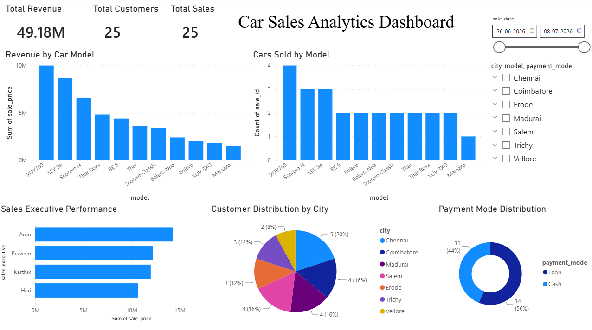

## 📌 Project Overview

The **Mahindra Showroom Sales Analytics Dashboard** is an end-to-end Data Analytics project developed using **MySQL** and **Power BI**.

The objective of this project is to analyze showroom sales performance, customer demographics, vehicle demand, payment preferences, and sales executive performance through an interactive dashboard.

The project demonstrates the complete Data Analytics workflow:

1. Database Design using MySQL
2. Data Insertion and Management using SQL
3. Data Modeling and Relationships
4. Data Visualization using Power BI
5. Business Insights and Recommendations

---

# 🛠️ Tools & Technologies

| Technology | Purpose                      |
| ---------- | ---------------------------- |
| MySQL      | Database Management          |
| SQL        | Data Manipulation & Analysis |
| Power BI   | Data Visualization           |
| GitHub     | Project Documentation        |

---

# 🗄️ Database Structure

The database consists of three relational tables:

## 1. Customers Table

Stores customer information.

| Column            |
| ----------------- |
| customer_id       |
| customer_name     |
| age               |
| gender            |
| phone             |
| email             |
| city              |
| state             |
| occupation        |
| annual_income     |
| registration_date |
| preferred_model   |

---

## 2. Cars Table

Stores Mahindra vehicle details.

| Column           |
| ---------------- |
| car_id           |
| brand            |
| model            |
| fuel_type        |
| transmission     |
| price            |
| mileage          |
| engine_cc        |
| seating_capacity |
| launch_year      |
| stock_quantity   |

---

## 3. Sales Table

Stores vehicle purchase transactions.

| Column             |
| ------------------ |
| sale_id            |
| customer_id        |
| car_id             |
| sale_date          |
| sale_price         |
| payment_mode       |
| loan_required      |
| loan_amount        |
| sales_executive    |
| delivery_date      |
| insurance_provider |
| warranty_years     |

---

# 🔗 Database Relationships

```text
Customers (1) ──────< Sales >────── (1) Cars
```

* customer_id links Customers and Sales
* car_id links Cars and Sales

---

# 📊 Dashboard Overview

## Key Performance Indicators (KPIs)

| KPI             | Value          |
| --------------- | -------------- |
| Total Revenue   | ₹49.18 Million |
| Total Customers | 25             |
| Total Sales     | 25             |

---

## Dashboard Screenshot



---

# 📈 Visualizations

### Revenue by Car Model

Analyzes revenue generated by each Mahindra vehicle model.

Key Findings:

* XUV700 generated the highest revenue.
* XEV 9e and Scorpio N were top-performing models.
* Marazzo generated the lowest revenue.

---

### Cars Sold by Model

Shows sales volume across vehicle models.

Key Findings:

* XUV700 was the best-selling vehicle.
* Scorpio N and XEV 9e maintained strong sales.
* Marazzo had comparatively lower sales volume.

---

### Sales Executive Performance

Measures revenue contribution by each sales executive.

Key Findings:

* Arun achieved the highest sales revenue.
* Hari recorded the lowest revenue among executives.

---

### Customer Distribution by City

Analyzes geographical distribution of customers.

Key Findings:

* Chennai contributed the highest customer base.
* Vellore contributed the lowest customer base.

---

### Payment Mode Distribution

Analyzes customer payment preferences.

Key Findings:

* Loan Purchases: 56%
* Cash Purchases: 44%

---

# 💡 Business Insights

### Revenue Drivers

Premium SUVs such as:

* Mahindra XUV700
* Mahindra XEV 9e
* Mahindra Scorpio N

generated the majority of showroom revenue.

---

### Financing Trends

More than half of customers preferred vehicle financing, highlighting the importance of attractive loan schemes and partnerships with financial institutions.

---

### Sales Team Analysis

The dashboard identified the highest-performing sales executive, enabling management to recognize top performers and optimize sales strategies.

---

### Regional Demand

Customer concentration was highest in Chennai, suggesting strong market demand in metropolitan regions.

---

# 🚀 Future Enhancements

* Monthly Sales Trend Analysis
* Vehicle Inventory Dashboard
* Customer Segmentation
* Predictive Sales Forecasting
* Regional Performance Analysis
* Profitability Analysis

---

# 🎯 Learning Outcomes

Through this project, I gained hands-on experience in:

* Relational Database Design
* SQL Query Development
* Data Modeling
* Power BI Dashboard Development
* KPI Creation
* Business Intelligence Reporting
* Data-Driven Decision Making


⭐ If you found this project useful, consider giving it a star.
